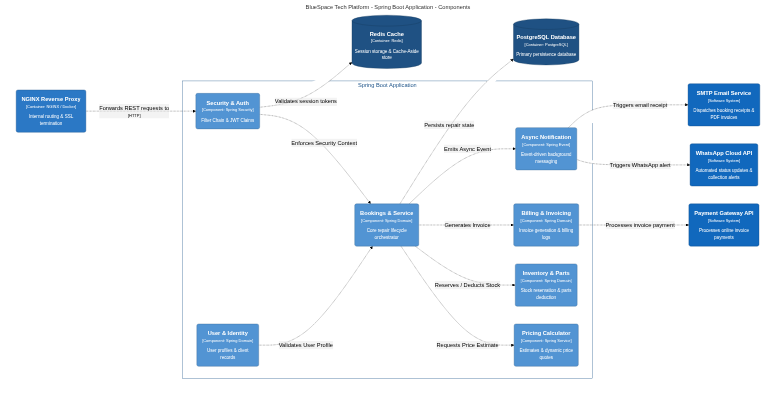

# BlueSpace Tech Platform - Architecture Documentation

This directory contains the C4 model architecture specifications for the **BlueSpace Tech Platform**, written in [Structurizr DSL](workspace.dsl) and automatically rendered as high-resolution diagrams via GitHub Actions.

---

## C4 Architecture Views

### Level 1: System Context Diagram
High-level view of users, external integrations (WhatsApp, Payment Gateway, SMTP), and the core BlueSpace Tech Platform.

---

### Level 2: Container Diagram
High-level tech stack showing Cloudflare CDN, NGINX Reverse Proxy, Spring Boot Application, Redis Cache, and PostgreSQL Database.

---

### Level 3: Component Diagram
Internal breakdown of the Spring Boot Application showing domain services (Security & Auth, Bookings & Service, Pricing Calculator, Inventory & Parts, Billing & Invoicing, Async Notification).

---

## Modifying Architecture Diagrams

1. Edit the Structurizr definition in `docs/architecture/workspace.dsl`.
2. Commit and push your changes to `main`.
3. GitHub Actions will automatically re-export and re-render all PNG diagrams at 3x scale.